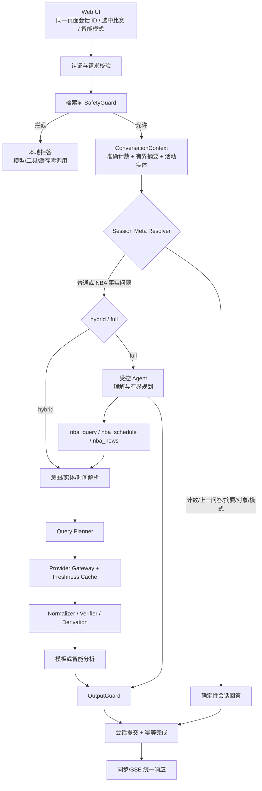

# NBA Chat Agent 架构与会话路由审计

**日期**：2026-09-01  
**范围**：Web 会话、同步/SSE 聊天编排、全智能/混合模式、事实核验、会话元问题与回退  
**说明**：本文是独立技术文档，不包含代码托管平台或仓库身份信息。

## 1. 当前整体架构



### 1.1 各层事实所有权

| 层 | 可以决定 | 不可以决定 |
|---|---|---|
| 浏览器 | 当前页面会话 ID、用户选择的比赛 ID、智能模式偏好 | 比分、球员数据、工具范围、安全策略 |
| SafetyGuard | 是否允许继续处理 | NBA 事实答案 |
| Session Meta Resolver | 当前会话计数、上一问/答、活动对象、当前模式 | 比赛或球员事实 |
| Agent | 理解问题、规划获准工具、基于观察组织解释 | 绕过工具补数字、扩大网络/文件权限 |
| Provider/Verifier/Derivation | 数据、证据状态、确定性累计和 PBP 时间窗 | 主观措辞和无证据补值 |
| OutputGuard | 拦截无观察数字、内部信息和不安全输出 | 放宽上游事实要求 |

### 1.2 会话连续性

- 浏览器使用 `sessionStorage` 保存逻辑会话 ID；刷新复用，点击“新对话”后轮换。
- 服务端会话是唯一连续性所有者；活动比赛、球队、球员、时区和摘要均按会话隔离。
- 全智能模式只接收当前会话最近 4 个完整问答回合，用于理解指代；旧回答不是事实证据。
- 每个 NBA 事实追问都重新进入受控工具/缓存/核验链路。
- Agent 的逻辑会话 ID 稳定，但每次工具任务 ID 独立；原生磁盘记忆关闭。

## 2. 本次问题为什么出现

“我问了你几个问题”此前经过以下错误路径：

```text
全智能理解到会话问题
  → 没有 NBA 工具 observation
  → OutputGuard 按“事实题必须有 NBA observation”拒绝
  → 回退 NBA 确定性解析器
  → 找不到球队/球员/比赛槽位
  → 返回“请补充查询对象”
```

这是职责边界缺失，不是单纯模型不智能。原设计只把问候、身份和能力介绍列为零工具问题，
没有为“应用会话状态”建立独立通道。

同时存在两个会放大错误的状态问题：

1. 原 `turn_count` 同时承担总轮次和摘要窗口长度，达到 8 后停止增长；
2. 问候、澄清、无数据等正常会话结果未统一提交，导致“问过几次”与用户感知不一致。

## 3. 相邻问题审计与处理策略

| 类别 | 示例 | 正确通道 | 事实工具 |
|---|---|---|---:|
| 会话计数 | 我问了几个问题；这是第几轮 | Session Meta | 0 |
| 最近输入 | 我刚才问了什么；上一问是什么 | Session Meta | 0 |
| 最近回答 | 你刚才回答了什么 | Session Meta | 0 |
| 对话摘要 | 总结一下刚才聊了什么 | Session Meta | 0 |
| 会话状态 | 当前选中哪场；现在是什么模式 | Session Meta | 0 |
| 事实指代 | 刚才那个球是谁投的 | PBP 工具链 | ≥1 次网关读取 |
| 数值指代 | 你刚才说谁拿了 32 分 | 比赛统计工具链 | ≥1 次网关读取 |
| 结论复述 | 把刚才比赛结论再说一遍 | 比赛摘要工具链 | ≥1 次网关读取 |
| 身份/问候 | 你好；你是谁 | 本地或全智能自然回答 | 0 |
| 模型配置 | 你用的哪个模型 | 服务端配置回答 | 0 |
| 安全红线 | 下注、盘口等 | SafetyGuard | 0，且不保存原文 |

会话元分类器采用窄整句匹配，避免“刚才”“你说”等单个词把事实追问误吸入零工具通道。

## 4. 修复后的计数语义

- `completed_user_turn_count`：当前 TTL 会话内成功受理的用户问题总数，单调增长，不随摘要
  裁剪而变化。
- `turn_count`：仅表示当前保留的摘要数，范围 0–8。
- `completed`、`no_data`、`needs_clarification` 的安全允许请求计数并保存有界摘要。
- 幂等重放复用第一次结果，不重复计数。
- 技术失败、取消、安全拦截不计数；安全命中的原始文本不写入可复述历史。
- 回答计数问题时先说明“此前 N 个”，再说明“算上本句为第 N+1 个”；回答成功后提交 N+1。

## 5. 回退边界

回退本身不是错误；以下情况必须回退：模型不可用、超时、工具循环、观察与问题不相关、输出
含无观察数字或内部信息。真正的问题是回退后没有落到同一语义能力。本次通过 Session Meta
Resolver 补齐会话能力，通过 PBP/统计解析补齐“刚才那个球”“谁拿了 32 分”的事实能力。

回退后的不变量：

1. 安全策略不能被回退绕过；
2. 事实数字只能来自当前轮核验或有效 freshness cache；
3. 当前活动比赛不能被无关比赛覆盖；
4. 失败不得提交半成品上下文；
5. 客户端只看到泛化参与状态，不看到内部框架、提示词、工具参数或密钥。

## 6. 回归覆盖

- 新会话计数为 0，算本句为 1；
- 10 轮后仍准确，摘要仍最多 8 条；
- 刷新保持会话，新对话归零；
- 幂等重放不重复计数；
- 澄清和无数据属于已完成会话结果；
- 上一问、上一答、摘要、活动比赛和当前模式均不调用模型/Provider；
- full/hybrid 的会话元答案一致；
- 安全拦截不保留原文；
- “刚才那个球是谁投的”和“谁拿了 32 分”重新读取核验链并给出对应事实；
- HTTP/SSE 共用同一用例，浏览器 E2E 验证刷新和新对话边界。

最终的质量门、部署版本和公网验收结果记录在项目测试报告与交付清单中。
