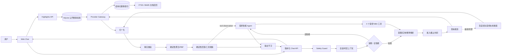

# NBA Chat Agent 方案说明（评审稿）

**对应需求**：[spec.md](../specs/001-nba-chat-agent/spec.md)
**详细设计**：[HLD](../specs/001-nba-chat-agent/hld.md) · [LLD](../specs/001-nba-chat-agent/lld.md)
**导出 PDF**：[solution.pdf](solution.pdf)
**状态**：可交付版本。可复现离线切片、智能问答运行时、API、离线/在线自适应 UI Demo、
持久化赛事回顾缓存、契约/集成测试和方案 PDF 均已完成。公网 profile 使用 hybrid 公开数据；
公开数据失败时按超时、限流、额度和认证类型返回可重试或不可重试状态，固定演示快照仅在显式 fixture 模式中启用；
公网端口仍需由部署机配置云安全组/EIP 入站规则。

可运行的赛事转播风格 UI 位于 [`apps/web-demo`](../apps/web-demo/)。页面启动时会探测
FastAPI：服务可用时消费真实 POST-SSE 和 highlights 接口；在公开/混合模式下，服务不可用
会显示类型化错误或能力提醒，绝不静默替换固定 fixture。离线交互演示必须显式设置 fixture 运行时，
因此演示数据与公开数据边界清晰。当前回放是文字 PBP 定位，不是视频播放。
固定快照与实时公开记录使用独立的来源标签；快照不会再显示为“刚刚联网核验”。公开
scoreboard 提供场馆时，场馆名称与城市会贯穿到赛事缓存、选卡上下文和聊天回答。

聊天默认处于“漫游模式”：左栏比赛卡只是浏览投影，首张卡和用户直接输入的 G4/对阵
条件都不会偷偷成为当前比赛。只有明确点击某张卡才进入“赛事下钻”，并由服务端根据
`selected_game_id` 注入已核验的比赛上下文；点击顶部状态即可退出下钻回到漫游。这样全局
问题不会被旧比赛污染，而“这场/最后几秒”等省略追问仍能在用户选卡后稳定继承同一场。

单端口启动方式（部署机和局域网访问推荐）：

```bash
cp .env.example .env  # 单端口部署可选；独立 4173 页面跨源调用 API 时需要它；不要提交 .env
set -a; . ./.env; set +a  # Settings 读取进程环境变量，不会自动解析 .env 文件
python3 -m pip install -e '.[dev]'
python3 -m apps.api.src.main
```

浏览器访问 `http://<服务器IP>:8000/`。FastAPI 会从同一端口托管 UI、聊天和 highlights。
本地演示或自动测试必须显式选择 fixture profile；`live` 与 `hybrid` 都只装配 allow-list
公开数据栈，任何公开数据错误都不会把固定快照挂成 Gateway fallback（详见
[quickstart](../specs/001-nba-chat-agent/quickstart.md)）。

公网演示通过 `docker-compose.public.yml` + `docker-compose.auth.yml` 启用 hybrid 公开数据和共享密码登录：静态入口和探活保持可用，聊天、
赛事焦点和日期接口要求短期 HttpOnly Cookie 会话。密码只从 `secrets/app_password` 读取，
不进入前端、响应或日志；缺失必需 secret 时服务 fail closed 并在 `/readyz` 标记认证依赖异常。

BYOK 需要单独说明：fixture 演示与自动测试完全离线且不需要模型 Key；启用全智能模式后，
请求在 SafetyGuard 和会话上下文之后直接进入有界智能 Agent 主链。原始用户问题保持不变，
结构化范围作为独立上下文传入，Agent 自主选择受控的 NBA 数据、赛程、新闻和网页搜索工具并
完成最终综合。它不能使用 shell、文件系统、浏览器、任意 URL、MCP、memory、skills 或子代理。
运行时实现、内部品牌和服务端配置只存在于部署边界，不写入系统提示词，也不进入公开 UI、
回答、SSE、telemetry 或日志。模型 Key 只能通过 secret 文件或受控环境注入，不能进入仓库或镜像；
面试演示的隐藏输入步骤见 [`docs/byok.md`](byok.md)。
同一个网页聊天在点击“新对话”前映射为稳定的逻辑会话，应用显式传入最近 4 个完整回合。
旧回答只用于理解指代，每个事实追问都必须重新调用服务端 NBA 工具核验；Agent 推荐的 G1–G7
只有解析到当前系列赛的已核验候选时才会绑定为活动比赛，后续“刚才推荐的那场”等追问会按
该 canonical game 重新取数。模型能力与 `PUBLIC_DATA_MODE` 独立；公开交付只使用 live/hybrid
公开数据栈。若启用真实 key，服务必须置于认证反代/VPN/受限安全组之后，
并设置供应商额度/限流；未认证的公网端口会带来额度消耗风险。

需要单独调试静态页面时，仍可运行 `python3 -m http.server 4173 --bind 127.0.0.1 --directory apps/web-demo`；
此时 API 必须额外运行在 8000，并配置相应的 `ALLOWED_ORIGINS`。

## 1. 目标与边界

本项目交付一个可在线访问的简体中文 NBA Web Chat。用户可以查询球队、球员、赛程、
赛果、统计、历史纪录和新闻背景，也可以围绕同一场比赛进行多轮追问。答案默认采用
北京时间（UTC+8），以 NBA 官方风格呈现：先给结论，再给结构化事实和必要的分析。

PDF 中的要求分为三类：联网公开取数、事实核验、时区/赛季、多轮、安全拦截和交付物是
硬性要求；流式输出、卡片、表格和顺畅的加载/错误反馈是体验加分项；A–I 是用于准备
黄金题集的参考题型，不把题型数量误当成 PDF 的固定规模要求。博彩、隐私绯闻、法律
犯罪、无证据假球和仇恨/侮辱等内容不在回答范围内；敏感请求必须在检索前短路。

## 2. 总体架构



Provider Gateway 是唯一的公开互联网访问边界。首版以公开体育数据适配器为实现起点，
但业务层只依赖可替换的 Provider port，并保留缓存、受控重试和显式离线 fixture。公开或
混合模式的 composition root 不会构造或挂载 FixtureProvider，查询失败时只返回真实的
无数据、部分核验或类型化技术错误；fixture 只属于显式演示/测试 profile。供应
商名称、端点、原始字段、提示词和内部证据 URL 只保存在内部契约/脱敏日志中，不进入用户
回答。

在线搜索以已配置的受控搜索适配器链为首选，百度网页与 DuckDuckGo Instant Answer 可作为验证页、限流或超时场景下的
固定 HTTPS 备用适配器。`nba_search` 通过独立的 `search_web` 操作先查本地 BM25，缺失时才调用该搜索链，
不会先消耗结构化体育新闻请求。两者都不接受用户 URL，限制查询、超时、最多 5 条结果和响应大小，
并移除 HTML、脚本、控制字符、链接和提示注入。搜索证据保持 `SEARCH`/部分核验，不能单独
把比分、排名、统计或 PBP 数字升级为已核验。首选搜索额度耗尽但后备搜索成功时，本轮仍用
后备资料完成回答并显示供应商无关的“在线搜索额度已用完”提醒；该能力状态在写共享缓存前
剥离。模型额度耗尽采用同一原则：有 SQLite/已核验事实就继续回答并提示，完全没有可用事实
才返回不可重试的技术失败，不能伪装成“暂无数据”。

Highlights API 在公开响应模型与数据源之间增加失败可退化的 SQLite 通用缓存。它只保存
已经过 Pydantic 校验的赛事列表和详情，不保存凭据、聊天、提示词、Cookie 或上游原始响应。
历史终场数据采用 stale-while-revalidate；今日、进行中比赛和未结束详情只允许短时 fresh
命中。详情按比分、leaders 和 PBP 完整度单调升级，低完整度或终场比分冲突的刷新不会覆盖
已有记录。“最近 5 场”先查询完整本地索引窗口，再决定是否联网补足；远端扫描预算耗尽得到的
partial 空列表不会写入 recent 缓存。Docker 具名卷使镜像重建和容器替换后仍能复用缓存；
缓存不可写时保持原数据链路。
公开 profile 的 recent 响应只包含公开赛事卡片；显式 fixture profile 才投影带演示标签的
固定快照。SQLite v5 和服务端选卡 registry 仍逐场保存来源，公开请求不会通过 fallback 混入
演示卡片，也不会把聚合来源套到全部比赛。

聊天侧另有一层与 HTTP 投影缓存分离的赛事索引。它不是把用户原句当作 SQLite key：先将
球队别名、赛季、日期、比赛状态和 G1–G7 归一化，再在关系字段上做精确过滤；球员统计和
逐回合按 `game_id` 关联。战报、新闻和战术背景属于非结构化证据，写入 FTS5 文档表，以
canonical entity token 解决“马刺”等中文短词的分词问题，再使用 BM25 对标题、正文和实体
字段加权排序。搜索网页只能进入部分核验文档表，不能生成结构化比分；固定演示快照也会在
写入前被拒绝。现阶段数据量和题目边界不需要独立向量数据库；若后续黄金题集显示同义改写
召回率不足，可在相同 Provider port 下增加向量候选，并继续让结构化条件负责硬过滤。

运维预热脚本 `scripts/warm-game-index.py` 支持赛季、球队和日期范围过滤，跨球队按公开比赛
ID 去重，可选补齐已结束比赛的球员数据、场馆、上座和时长。重复运行只做幂等 upsert；终场
比分冲突和低完整度覆盖会被拒绝。索引数据库放在 Docker 持久卷中，容器重建后仍可回答
`2026尼克斯-马刺`、系列赛大比分和 G5 球员数据等问题。

## 3. 一次请求如何被处理

1. API 校验消息长度、时区和幂等键，并生成 `request_id`/`session_id`。
2. Safety Guard 使用本地规则/分类器先判定红线。BLOCK 或 `OUT_OF_SCOPE` 直接返回礼貌
   拒答/篮球引导，Provider 和其缓存读取均为 **0**。
3. 允许请求加载当前会话上下文。常规模式进入确定性解析；全智能模式把用户原始问题、最近
   对话与服务端校验的赛事范围直接交给智能 Agent，由它选择工具并综合回答。应用会话经
   单向散列形成稳定逻辑 session，每轮另有独立工具 task ID；Agent 最多执行 4 次迭代/
   4 次工具调用，并且只能选择四个受控 NBA 工具。
4. NBA 工具或常规查询规划器调用 typed Provider port。适配器处理超时、限流、格式异常和
   公开搜索适配器之间的 failover；live/hybrid 的 Provider Gateway 永远没有 fixture fallback。
   Normalizer 将结果映射到统一领域模型并保留缺失值。
5. Verifier 检查证据可信度、新鲜度、实体/时间一致性和用户前提。系列赛累计、连胜和
   最后 5 秒等结果由确定性 Derivation 从真实比赛/PBP 记录计算，模型不负责算术或选球。
6. 显式 fixture profile 用于离线演示与确定性测试；公开 profile 的全智能请求由 Agent 理解
   错别字、日期和追问并保留其综合回答。明确日期/对阵的比赛过程问题先绑定比赛查询，
   不用赛程观察代替复盘。
   工具返回清洗后的状态/时间范围/事实块。客观、
   场馆、主客队教练等元数据及 PBP 的最终事实文字直接采用服务器确定性观察；Agent 可以组织战术/原因分析，
   但不能重新组合球队—比分—胜者关系，也不能把罚球/终场标记改写为运动战投篮。shell、通用
   网络、文件系统、浏览器、MCP、memory、skills 和子代理全部
   关闭。Output Guard 检查未观察数字、提示注入、敏感内容和内部字段泄露；同时识别工具预算、
   重试、截断等内部终止状态。若模型在完成工具后只返回残缺标题，服务会从已完成的结构化记录
   与网页证据重新组织完整回答。确定性恢复不是全智能主链：只有 Agent 超时、缺少可用观察、
   事实关系与可信记录冲突，或输出/安全守卫拒绝结果时才会触发；若可信观察不足，则返回对应
   的无数据、澄清、拦截或可重试错误，而不是套用固定模板或演示事实。
   SafetyGuard、Provider、Verifier、Derivation
   和 Output Guard 的事实与安全所有权不变。

   多轮历史由应用保存和裁剪：最近最多 4 个完整用户/助手回合、8 条消息/12 KiB。历史仅
   用于解析“那场”“最后那个球”，不能授权比分或统计；事实追问仍必须产生新的工具观察。
   Agent 的推荐场次只有命中本轮系列赛已核验候选后才可成为活动比赛；否定提及不会被误绑定。
   后续“为什么不是 G2”“推荐的那场最后一分钟”等问题继承同一系列赛与已绑定推荐场次，
   并重新查询 canonical game。点击“新对话”后应用 session、活动比赛、推荐场次和历史同时隔离。

   如果模型选择了与问题类型不符的工具（例如用赛程空结果回答球员数据或战术问题），服务端
   会把它视为缺少相关观察并进入限定性恢复，避免“工具调用成功但答非所问”。

   用户明确要求“联网实时查验”时，系统不把内部演示 ID 直接交给公开详情端点，而是按选中
   比赛的北京时间日期和主客对阵强制刷新主 scoreboard；只有唯一匹配到公开 event ID 才继续
   读取详情。该路径跳过旧缓存；公开栈本身不包含快照 fallback。未匹配只说明无法升级为
   公开核验，不会
   错说服务没有联网能力。

   同步和 SSE 的完成 envelope 还带有 provider-neutral 的 `composition` 标记：客观题为
   `deterministic`，智能 Agent 回答被接受时为 `agent/used`，旧 composer 为 `model/used`，
   超时、不可用或未启用时为 `fallback`。页面只显示“智能分析/已核验事实”等产品化状态，
   不展示内部运行时名称、模型密钥、端点、提示词或内部证据字段；评审者可通过脱敏完成
   envelope 和内部 telemetry 确认是否走过模型链路。

同步 HTTP 和 POST SSE 共用同一个用例；SSE 只在核验完成后发送事实增量，完成事件与同步
响应使用同一最终 envelope。断线会取消下游任务；重复 `client_message_id` 在同一会话
内幂等返回已保存结果。

## 4. 关键事实与时间规则

- 内部时间统一为带时区的 UTC Instant，用户默认看到 `Asia/Shanghai`。
- 赛季使用 `YYYY-YY`，Provider 的结束年份映射由 `SeasonClock` 统一处理；“本赛季/最近/
  卫冕冠军”结合可注入时钟和官方 active season 重新核验。
- PBP 时间窗先从完整 bundle 确定目标节次，再按节次剩余秒数做闭区间筛选；“全场最后 5 秒”
  只取最终节（含加时），明确某节时只取该节窗口。`sequence_valid=true` 时按节次、有效
  sequence 和 Provider 索引排序；序号不可信时降级到节次/剩余时钟/Provider 索引，并标记
  `sequence_valid=false`。缺失得分值保持为空，不用 0 补齐。
- 每个用户可见数字都能回溯到内部 `FactAssertion → Evidence`；冲突或缺失只显示“部分
  核验/暂无数据”，不以 0、旧缓存或模型记忆补齐。

## 5. 安全、隐私与可观测性

Safety Guard 在任何外部检索前运行；一条消息同时包含正常篮球问题和红线内容时整体拒答。
拒答不复述敏感词、不提供规避建议，只用 1–2 句引导回比赛、球员或球队数据。日志只保留
脱敏哈希、题型、状态、时延、证据状态、Provider 调用计数和缓存读写计数，不记录凭据、
原始敏感文本或不必要的个人信息；安全短路的 Provider/cache 计数必须均为 0。健康检查不
暴露上游 URL、缓存路径或 cache key；只提供持久缓存状态、条目数和有界计数器。

## 6. 评测与交付

版本化黄金集覆盖 A–I，并包含至少 10 条客观题；H 类使用同一会话至少三轮 `turns` 验证
上下文一致性，I 类和 `OUT_OF_SCOPE` 类验证检索前 `provider_call_count=0` 且缓存读写
计数为 0。每题按 PDF 的七个维度记录档位、可配置数值、TTFT、完整时延、证据状态和安全
否决；题意理解、事实准确或安全不合格时该题为 0 分。

当前仓库已经提交需求规格、研究记录、HLD、LLD、统一数据模型、HTTP/SSE/Provider/评测
契约、本地验收指南，以及彼此隔离的公开数据垂直切片与显式 fixture 回归环境：

- FastAPI 同步聊天、POST SSE、健康检查、日期范围 highlights 和按需比赛详情接口；
- 中文意图/实体/赛季解析、事实核验、系列赛与最后 5 秒 PBP 确定性推导；
- 会话隔离、推荐场次绑定、幂等重放、取消传播、TTL 缓存、公开源 failover、检索前安全短路和脱敏 telemetry；
- SQLite v5 精彩回顾缓存、逐场来源、历史 SWR、最近赛事本地窗口优先、最多五场详情预热和完整度防倒退；
- 全智能 Agent、四个任务级 NBA 工具（含独立 `search_web` 在线搜索）、旧 composer（默认关闭）与限定性确定恢复；
- 受控在线新闻/背景搜索，以及会话级“全智能分析”开关；
- 赛事转播风格静态 UI，默认处于“漫游模式”；用户进入“赛事下钻”后默认列出最近 5 场，
  可定位到今天或其他日期，并支持最多 93 天自定义时间区间；仅显式 fixture profile 可离线演示，
  公开 API 不可用时页面按故障类型显示错误；搜索或模型额度耗尽时显示明确能力提醒；请求在 250ms 内完成时
  不闪 loading，慢请求保留原卡片并只显示一处加载状态。
- 选中赛事后按需加载终场摘要、得分王和 PBP；PBP 事件后比分始终附带对应球队，避免内部
  主队—客队字段顺序与胜者优先的终场表述看似冲突；回答完成后给出基于当前上下文的后续问题建议，
  不让模型直接编造未核验的推荐事实。

当前代码包含事实、模型、安全、日期和认证测试（868 项 pytest）；浏览器 E2E 作为独立 npm profile 提供（30 项），
部署验收使用 `make deploy` / `make deploy-live`。智能运行时仍可在不改变
`AgentOrchestratorPort` 的前提下替换；无论采用何种实现，公开 UI 和系统提示词都只使用
产品身份，不出现私有运行时品牌。

## 7. 设计取舍与未决项

PDF 没有规定语言、模型、数据供应商、数据库、部署平台、并发量或具体时延阈值；Python
API + 零依赖静态 Web Demo（后续可替换为 React/Next.js）、ESPN-first、单 API 副本和 90%
查询 5 秒内的目标均是可替换的工程决策，不是题目硬性承诺。上线前必须重新核查公开数据
源的条款、robots、访问频率和稳定性。

“漫游模式”不请求日期投影；“赛事下钻”是左侧 scoreboard/highlights 的日期投影，不会占用聊天的
`HISTORY` 意图：进入赛事下钻后默认调用 `GET /api/v1/highlights/recent?limit=5`，自定义时间调用
`GET /api/v1/highlights/range`（最多连续 93 天）；查询超过 250ms 时前端显示一次明确的
“正在拉取”状态，快速缓存命中不清空当前内容，
未来日期、逆序日期和超长区间会被拒绝，空区间显示明确空状态。月历可用性接口仍保留给需要
逐日置灰的嵌入方：`GET /api/v1/highlights/availability`（最多连续 31 天）。
API 模式按服务端时钟计算“今天”；为保持离线 Demo 可复现，fixture 展示固定的
`2026-06-12` 样例，真实当天没有记录时会显示空状态。当前没有获得授权的直播源或视频切片，故 v1 只展示文字 PBP；未来在确认版权、来源和嵌入
策略后，可在同一投影旁增加可选媒体卡片，不让第三方 URL 进入聊天或任意抓取面。
