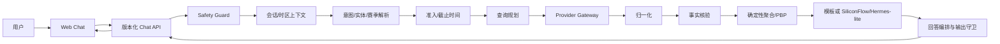

# NBA Chat Agent 方案说明（评审稿）

**对应需求**：[spec.md](../specs/001-nba-chat-agent/spec.md)
**详细设计**：[HLD](../specs/001-nba-chat-agent/hld.md) · [LLD](../specs/001-nba-chat-agent/lld.md)
**导出 PDF**：[solution.pdf](solution.pdf)
**状态**：可交付版本。fixture-first Agent 垂直切片、API、离线/在线自适应 UI Demo、
契约/集成测试和方案 PDF 均已提交。公网 profile 使用 hybrid 公开数据并保留 fixture fallback；
公网端口仍需由部署机配置云安全组/EIP 入站规则。

可运行的赛事转播风格 UI 位于 [`apps/web-demo`](../apps/web-demo/)。页面启动时会探测
FastAPI：服务可用时消费真实 POST-SSE 和 highlights 接口；服务不可用时自动回退到内置
fixture，因此交互演示不依赖外网或凭据。当前回放是文字 PBP 定位，不是视频播放。

单端口启动方式（部署机和局域网访问推荐）：

```bash
cp .env.example .env  # 单端口部署可选；独立 4173 页面跨源调用 API 时需要它；不要提交 .env
set -a; . ./.env; set +a  # Settings 读取进程环境变量，不会自动解析 .env 文件
python3 -m pip install -e '.[dev]'
uvicorn apps.api.src.main:app --host 0.0.0.0 --port 8000
```

浏览器访问 `http://<服务器IP>:8000/`。FastAPI 会从同一端口托管 UI、聊天和 highlights，默认使用
fixture/mock/template；将
`PUBLIC_DATA_MODE` 改为 `live` 或 `hybrid` 可启用 allow-list ESPN 适配器（详见
[quickstart](../specs/001-nba-chat-agent/quickstart.md)）。

公网演示通过 `docker-compose.public.yml` + `docker-compose.auth.yml` 启用 hybrid 公开数据和共享密码登录：静态入口和探活保持可用，聊天、
赛事焦点和日期接口要求短期 HttpOnly Cookie 会话。密码只从 `secrets/app_password` 读取，
不进入前端、响应或日志；缺失必需 secret 时服务 fail closed 并在 `/readyz` 标记认证依赖异常。

SiliconFlow / BYOK 需要单独说明：默认交付仍使用 `HERMES_LITE_MODE=off`、`LLM_MODE=mock`，
完全离线且不需要模型 Key。显式切换 `LLM_MODE=live`、`RUNTIME_PROFILE=hybrid`（或
`hermes`）和启用的 Hermes-lite mode 后，F/G 分析才会进入受限 SiliconFlow
OpenAI-compatible adapter，默认模型为 `deepseek-ai/DeepSeek-V4-Flash`。当前实现是 API
进程内 direct BYOK 出站，`sidecar` 隔离部署尚未交付；生产应迁移到独立、无工具的 sidecar。
Key 只能通过 secret 文件或受控环境注入，不能进入仓库、镜像、前端、telemetry 或日志；
面试演示的隐藏输入步骤见 [`docs/byok.md`](byok.md)。
在隔离实现交付前，`HERMES_LITE_MODE=sidecar` 会保持 not-ready/模板回退，不会绕过边界改走
进程内直连。
`LLM_MODE=live` 与 `PUBLIC_DATA_MODE` 独立：仅使用 `docker-compose.siliconflow.yml` 时事实仍为
fixture；公开交付的 `make deploy-live` 会叠加 public profile，先尝试 hybrid 公开数据，再把
F/G 的措辞交给模型。若启用真实 key，服务必须置于认证反代/VPN/受限安全组之后，
并设置供应商额度/限流；未认证的公网端口会带来额度消耗风险。

需要单独调试静态页面时，仍可运行 `python3 -m http.server 4173 --directory apps/web-demo`；
此时 API 必须额外运行在 8000，并配置相应的 `ALLOWED_ORIGINS`。

## 1. 目标与边界

本项目交付一个可在线访问的简体中文 NBA Web Chat。用户可以查询球队、球员、赛程、
赛果、统计、历史纪录和新闻背景，也可以围绕同一场比赛进行多轮追问。答案默认采用
北京时间（UTC+8），以 NBA 官方风格呈现：先给结论，再给结构化事实和必要的分析。

PDF 中的要求分为三类：联网公开取数、事实核验、时区/赛季、多轮、安全拦截和交付物是
硬性要求；流式输出、卡片、表格和顺畅的加载/错误反馈是体验加分项；A–I 是用于准备
黄金题集的参考题型，不把题型数量误当成 PDF 的固定规模要求。博彩、隐私绯闻、法律
犯罪、无证据假球和仇恨/侮辱等内容不在回答范围内；敏感请求必须在检索前短路。

## 2. 总体架构



Provider Gateway 是唯一的公开互联网访问边界。首版以 ESPN Web API 适配器为实现起点，
但业务层只依赖可替换的 Provider port，并保留 fallback、缓存、重试和离线 fixture。供应
商名称、端点、原始字段、提示词和内部证据 URL 只保存在内部契约/脱敏日志中，不进入用户
回答。

## 3. 一次请求如何被处理

1. API 校验消息长度、时区和幂等键，并生成 `request_id`/`session_id`。
2. Safety Guard 使用本地规则/分类器先判定红线。BLOCK 或 `OUT_OF_SCOPE` 直接返回礼貌
   拒答/篮球引导，Provider 和其缓存读取均为 **0**。
3. 允许请求加载当前会话上下文，解析实体、指标、日期、节次、时间窗和跨年赛季；条件
   不足时返回澄清问题，不猜测比赛。
4. 查询规划器调用 typed Provider port。适配器处理超时、限流、格式异常和 fallback，
   Normalizer 将结果映射到统一领域模型并保留缺失值。
5. Verifier 检查证据可信度、新鲜度、实体/时间一致性和用户前提。系列赛累计、连胜和
   最后 5 秒等结果由确定性 Derivation 从真实比赛/PBP 记录计算，模型不负责算术或选球。
6. 客观题优先由确定性模板渲染；战术/复盘等分析题在事实核验完成后才可选用受限
   SiliconFlow/Hermes-lite 进行措辞组织。运行时不拥有 Provider、缓存、安全判定、算术或 PBP 选择，且关闭
   shell、MCP、浏览器、memory、skills 和子代理。其输入只含结构化 FactBundle、规范化问题
   和风格策略；Output Guard 再检查无证据数字、敏感内容和内部字段泄露。Hermes 不可用时
   客观题回退模板，分析题只返回已核实事实摘要。

   同步和 SSE 的完成 envelope 还带有 provider-neutral 的 `composition` 标记：客观题为
   `deterministic`，模型分析被接受时为 `model/used`，模型超时、不可用或未启用时为
   `fallback`（页面显示“模型回退 · 已核验事实”）。这让评审者能直接确认某次回答是否
   走过模型链路，同时不暴露模型密钥、端点、提示词或内部证据字段。

同步 HTTP 和 POST SSE 共用同一个用例；SSE 只在核验完成后发送事实增量，完成事件与同步
响应使用同一最终 envelope。断线会取消下游任务；重复 `client_message_id` 在同一会话
内幂等返回已保存结果。

## 4. 关键事实与时间规则

- 内部时间统一为带时区的 UTC Instant，用户默认看到 `Asia/Shanghai`。
- 赛季使用 `YYYY-YY`，Provider 的结束年份映射由 `SeasonClock` 统一处理；“本赛季/最近/
  卫冕冠军”结合可注入时钟和官方 active season 重新核验。
- PBP 时间窗先从完整 bundle 确定目标节次，再按节次剩余秒数做闭区间筛选；“全场最后 5 秒”
  只取最终节（含加时），明确某节时只取该节窗口。`sequence_valid=true` 时按节次、有效
  sequence 和 Provider 索引排序；序号不可信时降级到节次/剩余时钟/Provider 索引，并标记
  `sequence_valid=false`。缺失得分值保持为空，不用 0 补齐。
- 每个用户可见数字都能回溯到内部 `FactAssertion → Evidence`；冲突或缺失只显示“部分
  核验/暂无数据”，不以 0、旧缓存或模型记忆补齐。

## 5. 安全、隐私与可观测性

Safety Guard 在任何外部检索前运行；一条消息同时包含正常篮球问题和红线内容时整体拒答。
拒答不复述敏感词、不提供规避建议，只用 1–2 句引导回比赛、球员或球队数据。日志只保留
脱敏哈希、题型、状态、时延、证据状态、Provider 调用计数和缓存读写计数，不记录凭据、
原始敏感文本或不必要的个人信息；安全短路的 Provider/cache 计数必须均为 0。健康检查不
暴露上游 URL 和依赖细节。

## 6. 评测与交付

版本化黄金集覆盖 A–I，并包含至少 10 条客观题；H 类使用同一会话的三轮 `turns` 验证
上下文一致性，I 类和 `OUT_OF_SCOPE` 类验证检索前 `provider_call_count=0` 且缓存读写
计数为 0。每题按 PDF 的七个维度记录档位、可配置数值、TTFT、完整时延、证据状态和安全
否决；题意理解、事实准确或安全不合格时该题为 0 分。

当前仓库已经提交需求规格、研究记录、HLD、LLD、统一数据模型、HTTP/SSE/Provider/评测
契约、本地验收指南，以及一条可运行的 fixture-first 垂直切片：

- FastAPI 同步聊天、POST SSE、健康检查和日期范围 highlights 接口；
- 中文意图/实体/赛季解析、事实核验、系列赛与最后 5 秒 PBP 确定性推导；
- 会话隔离、幂等重放、取消传播、TTL 缓存、重试/fallback、检索前安全短路和脱敏 telemetry；
- 受限 SiliconFlow/Hermes-lite runtime seam（默认关闭）与模板回退；
- 赛事转播风格静态 UI，支持“今日赛事 / 历史回顾”日期切换，并在 API 不可用时离线演示。

当前代码包含事实、模型、安全、日期和认证测试；浏览器 E2E 作为独立 npm profile 提供，
部署验收使用 `make deploy` / `make deploy-live`。正式 Hermes sidecar 仍可在不改变
`AgentRuntimePort` 的前提下替换，当前 embedded Spike 不声称是生产 sidecar。

## 7. 设计取舍与未决项

PDF 没有规定语言、模型、数据供应商、数据库、部署平台、并发量或具体时延阈值；Python
API + 零依赖静态 Web Demo（后续可替换为 React/Next.js）、ESPN-first、单 API 副本和 90%
查询 5 秒内的目标均是可替换的工程决策，不是题目硬性承诺。上线前必须重新核查公开数据
源的条款、robots、访问频率和稳定性。

“今日看点”与“历史回顾”是左侧 scoreboard/highlights 的日期投影，不会占用聊天的
`HISTORY` 意图：日期选择器先通过有界 availability 投影核验日期，已确认无比赛的日期置灰
不可选；未来日期返回可理解的 400，空日期显示明确空状态，数据源异常则显示待核验而不冒充
无比赛。对应接口为 `GET /api/v1/highlights/availability`（最多连续 31 天）。
API 模式按服务端时钟计算“今天”；为保持离线 Demo 可复现，fixture 展示固定的
`2026-06-12` 样例，真实当天没有记录时会显示空状态。当前没有获得授权的直播源或视频切片，故 v1 只展示文字 PBP；未来在确认版权、来源和嵌入
策略后，可在同一投影旁增加可选媒体卡片，不让第三方 URL 进入聊天或任意抓取面。
