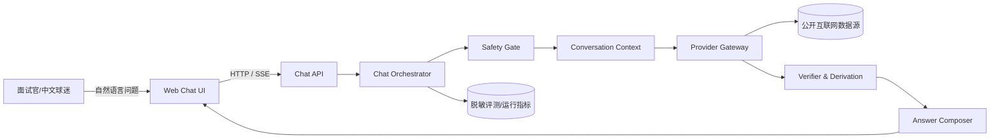
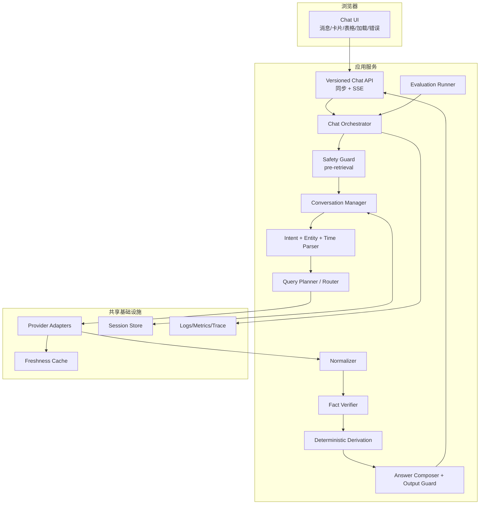
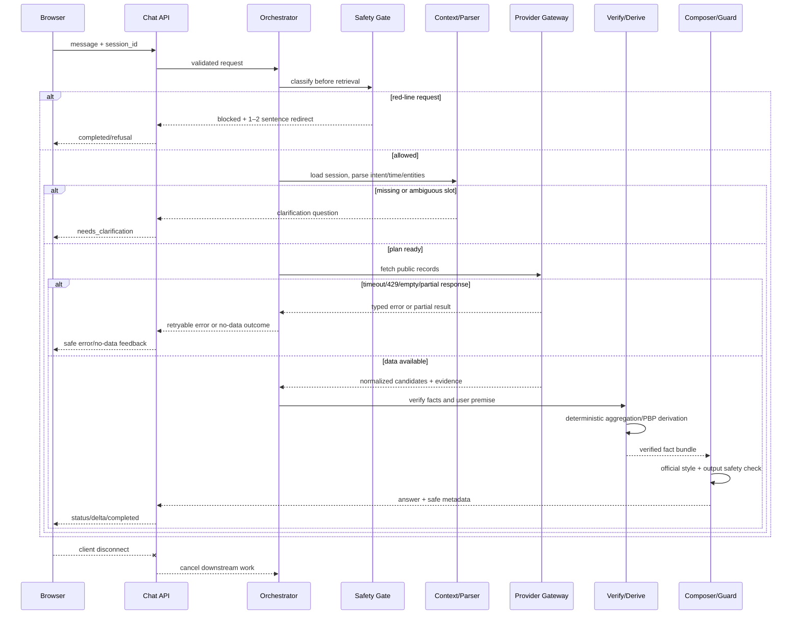
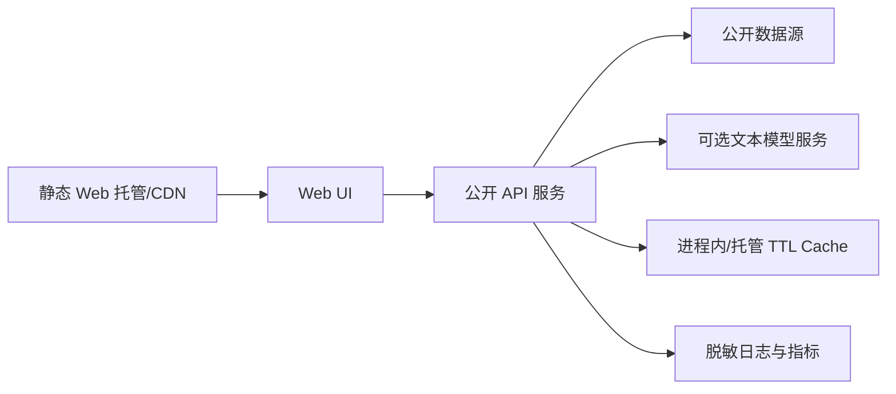

# NBA Chat Agent — High-Level Design (HLD)

**Feature**: [001-nba-chat-agent](spec.md)
**Status**: Proposed
**Date**: 2026-08-26
**Audience**: 面试评审、实现人员和部署维护人员

## 1. Design goals

本 HLD 把 PDF 的业务要求映射为一个可上线、可演示、可替换数据源的 Web Chat 产品。
首版优先级如下：

1. 事实可信：实时公开数据、时间口径正确、累计和逐回合可复核。
2. 安全合规：敏感红线在检索前拦截，拒答简洁且不泄露内部实现。
3. 对话可用：中文官方风格、多轮上下文、加载/流式/异常反馈。
4. 可评测可交付：在线链接、方案 PDF、黄金题集和可重复评测。

## 2. Requirements classification

| 类别 | PDF 要求 | 设计响应 |
|---|---|---|
| Hard | 联网公开取数、Web 聊天、多轮、敏感拦截 | Provider Gateway、Web UI、Session Context、Pre-retrieval Safety Gate |
| Hard | 官方风格、北京时间、事实核验 | Answer Policy、Season/Time Resolver、Verifier/Derivation |
| Hard | 在线产品链接 + 简要方案 PDF | 可部署 Web/API、`quickstart.md`、发布清单 |
| Evaluation | 七维加权评分，安全独立否决 | Evaluation Runner、黄金题集、Telemetry/Report |
| Bonus | 流式、动效、卡片、表格、顺畅加载/错误反馈 | SSE、状态事件、响应区块和 UI 交互 |
| Reference | A–I 题型仅供参考，非固定逐项清单 | 首版覆盖 A–I 作为评测集，能力按可验证路径扩展 |

## 3. Scope and non-goals

### In scope

- 中文球迷的公开 NBA 信息和分析问答。
- 赛程/赛果、球员/球队数据、历史纪录、新闻背景、play-by-play、战术和复盘。
- 公开来源实时查询、字段归一化、事实核验、确定性聚合及友好证据状态。
- 当前会话的多轮上下文（至少支持围绕一场比赛连续三轮追问）。
- Web 聊天、普通 HTTP 与 SSE 流式两种入口。

### Non-goals

- 账号、支付、社区、直播视频和推送。
- 博彩、下注、盘口建议或涉及金钱的预测；纯篮球夺冠/比赛走势预测仍在范围内。
- 未公开的 NBA 内部数据库和不可审计的“记忆答案”。
- 把系统建设为 NBA 之外的通用搜索引擎。

## 4. System context



外部参与者只有用户和公开数据源。系统不把供应商的响应格式、接口细节或模型提示词
暴露给用户；这些信息只在内部证据和脱敏日志中使用。

## 5. Container and component architecture



图中的 `Provider Adapters` 和 Provider 缓存只能由 `PLAN` 在 `SAFE → CTX → INT` 链路完成后
调用/读取；不存在 Orchestrator 绕过 Safety Guard 的旁路。BLOCK 或 `OUT_OF_SCOPE` 分支既不
访问 Provider，也不读写 Provider 缓存。

### Component responsibilities

| 组件 | 职责 | 明确不负责 |
|---|---|---|
| Web Chat UI | 输入、会话展示、增量文本、状态和错误呈现 | 事实判断、敏感策略、直接访问外网 |
| Chat API | 鉴权边界（如启用）、请求校验、同步/SSE 协议和版本 | 业务推理和供应商格式解析 |
| Safety Guard | 识别红线、生成 1–2 句拒答、在检索前短路 | 对敏感请求进行搜索或辩论 |
| Conversation Manager | 会话隔离、活动实体、轮次和上下文压缩 | 跨会话共享用户内容 |
| Intent/Time Parser | 题型、实体、槽位、赛季、日期和时区解析 | 代替事实数据源给答案 |
| Query Planner/Router | 按题型选择能力和新鲜度策略、拆分查询 | 生成未经核验的事实 |
| Provider Adapters | 调用公开来源、超时/限流处理、返回原始证据 | 将供应商 JSON 直接交给用户 |
| Normalizer | 统一实体、统计、比赛和 PBP 记录 | 猜测缺失字段 |
| Fact Verifier | 来源可信度、双源/记录一致性和用户前提核验 | 生成主观结论 |
| Derivation Engine | 系列赛累计、最近 N 场、PBP 时间窗等确定性计算 | 让 LLM 进行算术 |
| Answer Composer | 官方语气、结构化输出、事实/分析分层 | 改写或掩盖核验失败 |
| Output Guard | 检查红线、无证据数字和内部细节泄露 | 放宽安全政策 |
| Evaluation Runner | 黄金题、重复回放、评分和时延报告 | 修改线上答案 |

## 6. Request and data flow



关键约束：

- `Safety Gate` 返回 BLOCKED 或 `OUT_OF_SCOPE` 后，Provider Gateway 调用次数以及 Provider
  缓存读写次数必须为 0。
- 客观问题必须走 `fetch → normalize → verify → derive`，不可由生成模型直接报数。
- 用户前提核验失败时，回答包含纠正而不是把错误前提带入后续计算。
- 主观、战术和复盘回答必须引用已核实事实，并明确“分析/推断”。

## 7. Data-source strategy

首版以 ESPN 公开 Web API 适配器作为实现起点。2026-08-26 实测（HTTP 200；具体请求和
字段映射记录在 [research.md](research.md) 与 Provider contract）可用的能力包括：

- 按日期查询赛程/赛果（scoreboard）。
- 比赛摘要、球队/球员 box score 和（端点提供时的）系列赛上下文（summary）。
- 逐回合事件（play-by-play），包含节次、时钟、比分、得分值和参与者。
- 球队赛程/名单及球员资料、赛季统计等扩展端点。

这些端点的可用性、访问频率和授权并非 PDF 保证，因此必须通过 `ProviderPort` 隔离，
并为官方来源或其他可靠来源保留 fallback。每个适配器都要实现：

- 请求超时、429/5xx 重试和熔断；
- 原始响应校验及缺字段保留 `null`；
- 统一 `Evidence`（内部来源标识、URL、获取时间、数据截至时间、可信度）；
- 可用 fixture，便于无网测试和面试演示；
- 遵守服务条款、robots 和访问频率，禁止绕过访问控制。

缓存按新鲜度分层：实时赛程/比分约 30–60 秒、box score 约 5 分钟、历史资料约 24 小时；
具体 TTL 作为配置，不得让过期数据冒充“当前”。

## 8. UI/interaction architecture

Web 页面由聊天窗口、消息列表、状态条、事实卡片/表格和错误状态组成。客户端状态机为：

```text
IDLE → SUBMITTING → STATUS → STREAMING → DONE
                         ├→ NEEDS_CLARIFICATION
                         ├→ BLOCKED
                         └→ ERROR → RETRYING | IDLE
```

UI 验收目标（属于评分体验目标，不改变事实契约）：

- 320px–1440px 宽度下消息、表格和卡片不溢出；窄屏优先纵向布局。
- 输入框、发送、停止、重试和折叠证据卡可用键盘操作，并提供可读的 ARIA label/live region。
- Markdown 只允许白名单标签，数字加粗由安全 renderer 生成，禁止原始 HTML/XSS。
- 流式断开显示“连接中断/重试”，不得清空已显示的完整答案；加载阶段显示友好进度。
- 空结果、部分核验和安全拒答具有不同视觉状态，且不显示内部 provider/API 信息。

## 9. Deployment topology



推荐以一个可本地复现的容器化 API 和一个 Web 前端部署；v1 公网演示默认单 API 副本，或
必须启用粘性会话。若扩展到多副本，必须改用共享 SessionStore 和共享幂等存储，并通过三轮
同场追问探活验证会话连续性；具体云厂商不作为规格要求。
环境配置通过变量注入，至少包括数据源开关、模型开关、请求超时、缓存 TTL、日志级别和
允许的前端来源。无凭据或外网不可用时，`mock/fixture mode` 仍可运行基准题和安全测试。

## 10. Cross-cutting concerns

### Safety and privacy

- 分类顺序：安全红线 → 题型（客观/主观/敏感/时效）→ 实体/时间解析。
- 红线包含政治/涉华/社会争议、场外隐私/绯闻、法律/犯罪/司法、无证据黑哨假球、
  博彩/盘口/下注、人身攻击/地域歧视/仇恨/侮辱性绰号。
- 拒答模板 1–2 句，礼貌引回 NBA；不得映射侮辱性绰号到真实球员。
- 日志只保留必要的哈希、题型、状态和耗时；删除凭据、原始敏感文本和不必要的个人信息。

### Observability

每个请求生成关联 ID，记录：题型、会话轮次、状态、上游类别（非用户可见）、缓存读写/命中、
核验状态、TTFT、完整响应耗时、错误类型和安全判定。指标至少包括成功率、空结果率、
Provider 429/5xx、模型失败率、P50/P90 时延和红线短路次数；红线/范围外短路的 Provider
及缓存访问计数必须可审计为 0。

### Availability and performance targets

PDF 只规定按耗时评级，没有数字阈值；本项目暂定目标为 90% 正常查询在 5 秒内完成，
并单独记录首 token 和完整答案耗时。上游超时目标约 8 秒后返回可重试提示；这些都是工程
目标，可在压测后调整，不改变 PDF 评分口径。

## 11. Risks and mitigations

| 风险 | 影响 | 缓解 |
|---|---|---|
| 公开接口限流/变化 | 实时问题失败 | 适配器隔离、缓存、退避、fallback、fixture |
| 数据源之间口径不同 | 评分事实不一致 | 字段映射、时间口径、双源核对和证据等级 |
| LLM 幻觉/算术错误 | 事实失分 | 模板优先、确定性推导、Output Guard、无证据不报数 |
| 安全分类漏检 | 一票否决 | 词典+分类器、检索前硬门、红队黄金集 |
| 多轮上下文串线 | 一致性失分 | 会话 ID 隔离、活动实体显式化、跨会话测试 |
| 代理缓冲 SSE | 体验变差 | 心跳、禁用不当压缩、同步接口降级 |
| 交付链接不可访问 | 无法评审 | 发布前探活、部署清单和本地 fixture 演示 |

## 12. HLD-to-requirement traceability

| 需求 | HLD 组件/策略 | LLD/测试落点 |
|---|---|---|
| FR-001–007 | Web UI、Chat API、Answer Policy | `contracts/http-api.md`、UI/E2E |
| FR-008–012 | Intent/Time Parser、Season Clock、Entity Resolver | `data-model.md`、解析单测 |
| FR-013–018 | Provider Gateway、Normalizer、Verifier、Derivation | `contracts/provider-adapter.md`、fixture/集成测 |
| FR-019–021 | Pre-retrieval Safety Guard、Refusal Templates | 安全红队测试、provider call=0 断言 |
| FR-022–023 | Resilience、Observability、Session Store | 错误契约、超时/429/隔离测试 |
| FR-024–026 | Evaluation Runner、报告和方案文档 | `contracts/evaluation.md`、黄金题回放 |

## 13. Decisions deferred to implementation

模型供应商、最终公开数据 fallback、托管平台、持久化会话存储和认证策略均不是 PDF 指定项。
LLD 将通过窄接口和配置开关保持可替换；任何新增复杂度必须在 plan 的 Complexity Tracking
中说明理由和可验证收益。
