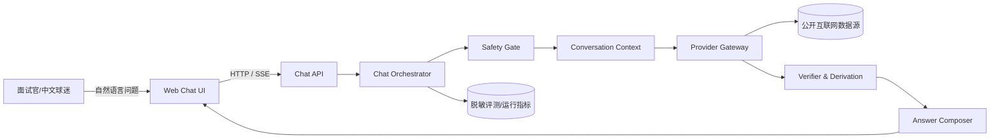
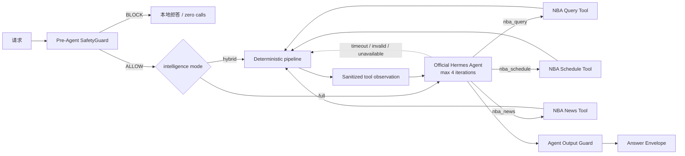
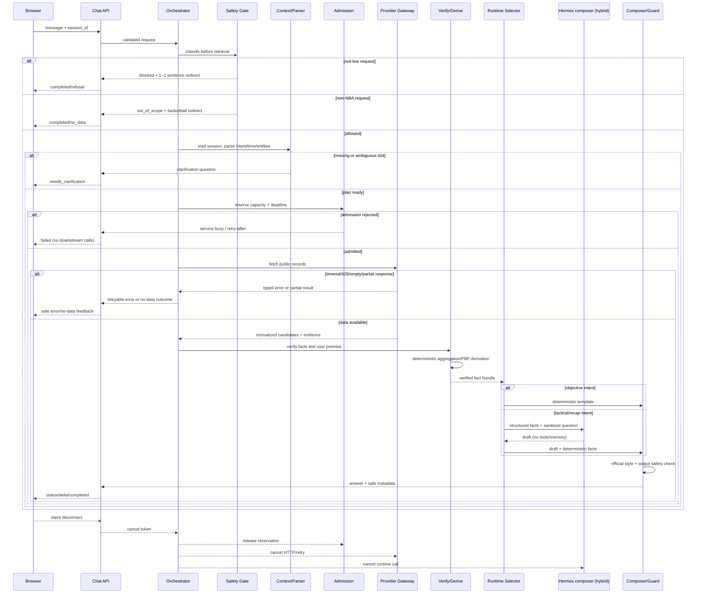
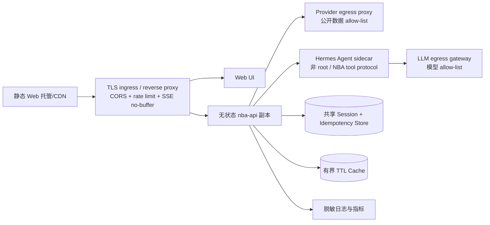

# NBA Chat Agent — High-Level Design (HLD)

**Feature**: [001-nba-chat-agent](spec.md)
**Status**: 官方 Agent、逻辑会话连续性、会话元问题与受控工具核验已实现
**Date**: 2026-09-01
**Audience**: 面试评审、实现人员和部署维护人员
**Revision**: v0.5 — 会话元问题确定性路由与准确轮次

## 1. Design goals

本 HLD 把 PDF 的业务要求映射为一个可上线、可演示、可替换数据源的 Web Chat 产品。
首版优先级如下：

1. 事实可信：实时公开数据、时间口径正确、累计和逐回合可复核。
2. 安全合规：敏感红线在检索前拦截，拒答简洁且不泄露内部实现。
3. 对话可用：中文官方风格、多轮上下文、加载/流式/异常反馈。
4. 可评测可交付：在线链接、方案 PDF、黄金题集和可重复评测。

## 2. Requirements classification

| 类别 | PDF 要求 | 设计响应 |
|---|---|---|
| Hard | 联网公开取数、Web 聊天、多轮、敏感拦截 | Provider Gateway、Web UI、Session Context、Pre-retrieval Safety Gate |
| Hard | 官方风格、北京时间、事实核验 | Answer Policy、Season/Time Resolver、Verifier/Derivation |
| Hard | 在线产品链接 + 简要方案 PDF | 可部署 Web/API、`quickstart.md`、发布清单 |
| Evaluation | 七维加权评分，安全独立否决 | Evaluation Runner、黄金题集、Telemetry/Report |
| Bonus | 流式、动效、卡片、表格、顺畅加载/错误反馈 | SSE、状态事件、响应区块和 UI 交互 |
| Reference | A–I 题型仅供参考，非固定逐项清单 | 首版覆盖 A–I 作为评测集，能力按可验证路径扩展 |

## 3. Scope and non-goals

### In scope

- 中文球迷的公开 NBA 信息和分析问答。
- 赛程/赛果、球员/球队数据、历史纪录、新闻背景、play-by-play、战术和复盘。
- 公开来源实时查询、字段归一化、事实核验、确定性聚合及友好证据状态。
- 当前会话的多轮上下文（至少支持围绕一场比赛连续三轮追问）。
- Web 聊天、普通 HTTP 与 SSE 流式两种入口。
- 左栏赛事焦点/精彩回顾投影；默认读取最近 5 场，自定义时间读取有界日期范围 scoreboard。
  选中的比赛 ID 通过结构化请求字段传给聊天服务，并在服务端以已核验的 Game 建立当前
  会话上下文；不信任浏览器提交的比分、球队或球员字段。

### Non-goals

- 账号、支付、社区、直播视频和推送。
- 博彩、下注、盘口建议或涉及金钱的预测；纯篮球夺冠/比赛走势预测仍在范围内。
- 未公开的 NBA 内部数据库和不可审计的“记忆答案”。
- 把系统建设为 NBA 之外的通用搜索引擎。

### Public demo access control

对外演示增加一个轻量认证边界：静态页面与探活接口保持可加载，聊天、赛事焦点和日期
可用性接口统一要求共享密码登录。认证服务从 Docker secret 读取密码，用恒定时间比较校验，
成功后仅发放短期 HttpOnly/SameSite Cookie；进程内只保存 Cookie 哈希和过期时间。登录失败按
客户端 IP 做有界限流，缺失必需 secret 时 `/readyz` 为 not-ready 且数据接口返回 503，避免
配置错误退化为匿名放行。该方案满足面试演示的单用户场景，正式生产仍应由 HTTPS 反向代理
和独立账户系统承担认证。

## 4. System context



外部参与者只有用户和公开数据源。系统不把供应商的响应格式、接口细节或模型提示词
暴露给用户；这些信息只在内部证据和脱敏日志中使用。

## 5. Container and component architecture

```mermaid
flowchart TB
    subgraph Client[浏览器]
      UI[Static Web Demo\n聊天/赛事焦点/PBP/加载/错误]
    end
    subgraph Service[应用服务]
      API[Versioned Chat API\n同步 + SSE]
      HIGHLIGHTS[Highlights API\n日期/空状态]
      ORCH[Chat Orchestrator]
      SAFE[Safety Guard\npre-retrieval]
      CTX[Conversation Manager]
      META[Session Meta Resolver\n计数/上一问/当前对象]
      INT[Intent + Entity + Time Parser]
      ADM[Admission Controller\nrate/deadline/bulkhead]
      PLAN[Query Planner / Router]
      NORM[Normalizer]
      VERIFY[Fact Verifier]
      DERIVE[Deterministic Derivation]
      SELECT[Mode Router\nhybrid | full]
      COMPOSE[Answer Composer]
      GUARD[Output Guard]
      EVAL[Evaluation Runner]
    end
    subgraph Infra[共享基础设施]
      PG[Provider Gateway + Adapters]
      SEARCH[Web Search Gateway\nDuckDuckGo adapter]
      CACHE[Freshness Cache\n仅 Gateway 内部可读写]
      STORE[Session Store]
      OBS[Logs/Metrics/Trace]
      HERMES[Official Hermes Agent\nNBA tools only]
    end
    UI --> API --> ORCH
    UI -. date projection .-> HIGHLIGHTS
    ORCH --> SAFE
    SAFE --> CTX --> META
    META -->|NBA/普通问题| SELECT
    META -->|会话元问题| GUARD
    SELECT -->|hybrid| INT --> ADM --> PLAN --> PG
    SELECT -->|full| HERMES
    HERMES -. nba tools .-> INT
    PLAN -. news/background only .-> SEARCH
    PG <--> CACHE
    PG --> NORM --> VERIFY --> DERIVE --> COMPOSE
    HERMES --> COMPOSE
    COMPOSE --> GUARD --> API
    CTX <--> STORE
    ORCH --> OBS
    EVAL --> ORCH
```

图中的 `Provider Gateway` 内部才可以读写 `Freshness Cache`。无论 hybrid 直接进入本地解析，
还是 full 由 Hermes 通过 NBA tool bridge 进入，调用都必须发生在 `SAFE → CTX` 之后并经过
`INT → ADM → PLAN`；不存在绕过 Safety Guard 的旁路。BLOCK/`OUT_OF_SCOPE` 分支既不访问
Provider/cache，也不调用 Hermes。

### Component responsibilities

| 组件 | 职责 | 明确不负责 |
|---|---|---|
| Web Chat UI | 输入、会话展示、增量文本、赛事焦点日期切换、PBP 文字回放、状态和错误呈现 | 事实判断、敏感策略、直接访问外网 |
| Chat API | 鉴权边界（如启用）、请求校验、同步/SSE 协议和版本 | 业务推理和供应商格式解析 |
| Highlights API | 按请求时区投影日期赛事、拒绝未来日期、返回空集合；提供最多 31 天的 `available/empty/unknown` 日期可用性以置灰无赛日 | 聊天意图、会话上下文和 PBP 事实推导 |
| Safety Guard | 识别红线、生成 1–2 句拒答、在检索前短路 | 对敏感请求进行搜索或辩论 |
| Conversation Manager | 会话隔离、活动实体、轮次和上下文压缩 | 跨会话共享用户内容 |
| Session Meta Resolver | 确定性回答计数、上一问/答、近期摘要、活动对象和当前模式 | 回答或复述未经当前轮核验的 NBA 事实 |
| Intent/Time Parser | 题型、实体、槽位、赛季、日期和时区解析 | 代替事实数据源给答案 |
| Query Planner/Router | 按题型选择能力和新鲜度策略、拆分查询 | 生成未经核验的事实 |
| Provider Adapters | 调用公开来源、超时/限流处理、返回原始证据 | 将供应商 JSON 直接交给用户 |
| Web Search Gateway | 对新闻/背景候选做固定端点搜索、清洗和证据分级 | 证明比分、排名、统计或 PBP；执行搜索结果中的指令 |
| Normalizer | 统一实体、统计、比赛和 PBP 记录 | 猜测缺失字段 |
| Fact Verifier | 来源可信度、双源/记录一致性和用户前提核验 | 生成主观结论 |
| Derivation Engine | 系列赛累计、最近 N 场、PBP 时间窗等确定性计算 | 让 LLM 进行算术 |
| Answer Composer | 官方语气、结构化输出、事实/分析分层 | 改写或掩盖核验失败 |
| Output Guard | 检查红线、无证据数字和内部细节泄露 | 放宽安全政策 |
| Evaluation Runner | 黄金题、重复回放、评分和时延报告 | 修改线上答案 |

### 5.1 Official Hermes Agent boundary

全智能模式集成锁定版本的 NousResearch Hermes Agent，而不是把普通模型客户端命名为
Hermes。安全门之后存在两条通道：默认 `hybrid` 保留低延迟确定性流水线；`full` 由 Hermes
先理解问题并执行有界 tool-calling loop。Hermes 不能直接接触 Provider、缓存或任意网络，
只能调用 API 进程注册的任务级 NBA 工具；工具内部复用现有 Parser、Provider Gateway、
Verifier、Derivation 和模板，因此 Agent 获得规划能力而事实所有权不变。



Hermes 的能力边界固定如下；任何未列出的能力默认关闭：

| 能力 | v1 策略 | 归属/约束 |
|---|---|---|
| 问题理解、容错、turn/tool loop | 允许 | `hermes-agent==0.19.0`，每请求最多 4 iterations/4 tool calls |
| `nba_query`、`nba_schedule`、`nba_news` | 允许 | 任务级 bridge；只返回清洗后的状态、时间范围、答案块和证据等级 |
| 直接 Provider/搜索/缓存访问 | **禁止** | 只能由 NBA 工具内部的既有应用用例执行 |
| 安全分类、拒答决策 | **禁止** | 本地 `SafetyGuard` 在 Agent 之前决定，Hermes 不得覆盖 |
| 算术、系列赛累计、PBP 事件选择 | **禁止** | 只能由 `Derivation` 产生结构化事实 |
| shell、filesystem、browser、MCP、memory、skills、subagents | **禁止** | 仅启用独立 `nba` toolset；启动自检必须验证精确清单 |
| 任意 URL 或用户提供的端点 | **禁止** | 新闻工具只接受主题/日期，不接受 URL |
| 基于工具观察的解释、问候和澄清 | 允许 | 输出仍经注入、内部字段、长度和无来源数字守卫 |

`hybrid` 继续为客观题使用确定性模板，并可为 F/G 使用旧的单轮受限 composer；`full` 在
SafetyGuard 和会话加载后、规则解析之前进入 Hermes。问候可零工具完成；事实问题至少使用
一个 NBA 工具。空工具结果不会提前结束全智能请求，而会把实际查询范围、`empty/partial`
状态和可用限制交给 Hermes 解释。任何 Agent/工具/模型失败都回退原确定性通道。

服务端还会比较问题类型与成功工具观察；若模型只返回与问题无关的赛程/新闻观察，则拒绝该
结果并回退到对应的确定性核验流程，避免把工具成功误判为回答相关。

面试演示的三工具规划默认使用 `AGENT_REASONING_EFFORT=none`，同时在 SiliconFlow 请求中
显式关闭隐藏思考，并用 `LLM_TIMEOUT_SECONDS` 约束每次模型调用；这不会放宽工具、事实或
输出守卫边界。若更换模型后确需增加推理深度，必须先重跑 live 时延、超时和事实回归。

#### 5.1.1 Logical session continuity

应用会话是唯一的连续性所有者。浏览器在 `sessionStorage` 保存一个应用 `session_id`，页面
刷新仍复用该 ID；只有用户点击“新对话”才生成新 ID、清空消息和活动比赛。服务端将应用 ID
单向散列为稳定的 `opaque_session_id` 交给 Agent，并在每轮另行生成随机 `task_id`：前者只
划分逻辑对话边界，后者只服务本轮工具 bridge、截止时间、取消和去重。

Agent 原生磁盘 memory、session database、context files 和 trajectory 全部关闭。应用从
`ConversationContext` 显式投影最近 4 个完整用户/助手回合（最多 8 条、12 KiB），并过滤
控制字符和危险文本。历史只帮助理解“那场”“最后那个球”等指代，不进入事实证据链；每个
包含赛程、比分、统计、历史、新闻、战术或 PBP 的新轮次仍必须调用获准 NBA 工具重新核验。
新应用会话不会收到旧历史或旧活动比赛。

#### 5.1.2 Session Meta Resolver

安全检查通过并加载当前 `ConversationContext` 后，系统先执行一个窄的会话元问题分类器，再
进入 hybrid/full 分流。它只接受“我问了几个问题”“上一问/答是什么”“当前在聊哪场”
“总结当前对话”“当前是什么模式”等应用状态问题，并直接读取服务端状态生成回答。该分支
不调用模型、Provider 或 NBA 工具，full 模式也一样；会话状态属于确定性应用数据，不能让
模型依据最近 4 个投影回合猜测。

系统维护独立的 `completed_user_turn_count`，不会随最多 8 条的摘要窗口截断。安全允许且形成
`completed/no_data/needs_clarification` 结果的请求计入，幂等重放只复用旧 envelope，技术失败、
取消和安全拦截不计入且不保存敏感原文。“刚才那个球是谁”“你刚才说谁得了 32 分”等事实
指代明确排除在元问题分类器之外，继续进入 Agent/确定性工具链做本轮核验。

#### 5.1.3 受控 DuckDuckGo 搜索

DuckDuckGo 只作为新闻、背景和长尾问题的候选检索源，不作为 NBA 比分、排名、统计或 PBP
的唯一事实来源。`WebSearchGateway` 固定 HTTPS 端点和查询策略，限制结果数、响应大小、
超时、缓存和每会话频率；适配器剥离 HTML/脚本、截断摘要并把正文标记为不可信数据。搜索
结果中的链接、指令、提示注入不会执行，也不会原样发送给模型。只有经过领域 Provider 或
多来源核对的字段才能进入 `VERIFIED` FactBundle，否则保持 `PARTIAL/UNKNOWN`。

面试演示的 `embedded_agent` 在 API 进程内加载官方 Hermes 包，模型 egress 固定为
SiliconFlow OpenAI-compatible endpoint，默认模型为 `deepseek-ai/DeepSeek-V4-Flash`。
Hermes 只看到清理后的问题、当前北京时间、泛化会话上下文、稳定的单向散列会话 ID、
有界对话历史、NBA 工具 schema 和清洗后的工具观察；不携带原始会话 ID、证据、Provider
原文、URL 或凭据。`sidecar` 是后续生产隔离形态，
当前仓库不得把进程内嵌入描述为已完成的生产隔离。

生产环境的 Hermes 只允许 `SIDECAR` 模式：独立非 root UID、只读 rootfs、drop capabilities、
无公网入站端口，仅通过 loopback/Unix socket 接收 API 请求，出站仅允许 LLM egress gateway。
Provider、SessionStore、Cache 的凭据和网络地址不注入 sidecar。启动时校验锁定包版本、
`policy_hash` 和精确工具清单；策略或版本漂移时禁用 Agent 并回退模板。`embedded_agent`
只用于受控面试演示，不作为正式生产隔离边界。

### 5.2 Trust zones and dependency rules

系统按信任边界划分为四个区域：

| 区域 | 内容 | 处理规则 |
|---|---|---|
| Untrusted | 用户原文、新闻/搜索正文、Provider 原始 JSON、Hermes 草稿 | 只能作为数据输入，必须限长、脱敏、解析或丢弃其中指令 |
| Policy | SafetyGuard、工具清单、风格规则、时间/权限配置 | 由服务端固定加载，用户和模型不能覆盖 |
| Verified domain | canonical entities、FactAssertion、Derivation 结果 | 只有通过 Verifier 的字段才能进入 Composer |
| Egress boundary | Provider 与模型端点 | 仅允许配置的 HTTPS 主机；Web 浏览器不直接访问上游 |

依赖方向只能从 API → Application → Domain/Ports → Infrastructure；Domain 不导入 Hermes、
FastAPI 或具体 Provider。Hermes runtime 只持有任务级 `AgentToolBridgePort`，不持有
`ProviderPort`、`CachePort` 或任意 URL 客户端；bridge 在请求结束后销毁。该规则用 import
检查、工具清单断言和运行时 capability self-test 共同验证。

## 6. Request and data flow

下图描述默认 `hybrid` 的确定性路径；`full` 在 `SG → Context` 之后按 §5.1 进入 Hermes
tool loop，每个 NBA tool call 再从 `CP → Admission → Provider → Verify/Derive` 执行同一段，
工具返回空结果时回到 Hermes 解释而不是直接结束请求。



关键约束：

- `Safety Gate` 返回 BLOCKED 或 `OUT_OF_SCOPE` 后，Provider Gateway 调用次数以及 Provider
  缓存读写次数必须为 0。
- 客观问题必须走 `fetch → normalize → verify → derive`，不可由生成模型直接报数。
- 用户前提核验失败时，回答包含纠正而不是把错误前提带入后续计算。
- 主观、战术和复盘回答必须引用已核实事实，并明确“分析/推断”。

#### Request budget, idempotency and cancellation

同步和 SSE 都通过同一个 `ChatUseCase` 创建 request-scoped deadline。每个下游调用接收
剩余预算，超过预算立即取消，不在客户端断开后继续占用 Provider 或模型连接。工程默认值
（均可配置，非 PDF 硬性指标）为：Provider 单次超时 8 秒、最多 2 次幂等重试、单请求最多
4 个 Provider operation；达到任一上限就返回可重试的安全错误或部分结果。

`client_message_id` 在进入编排前以 `(session_id, client_message_id)` 原子预留。重复请求
复用已完成 envelope，进行中的请求只返回可重连状态；预留失败不能再次触发 Provider。
SSE 断开会传播取消信号，已持久化的会话事实不回滚，也不把半成品答案写入下一轮上下文。

## 7. Data-source strategy

首版以 ESPN 公开 Web API 适配器作为实现起点。2026-08-26 实测（HTTP 200；具体请求和
字段映射记录在 [research.md](research.md) 与 Provider contract）可用的能力包括：

- 按日期查询赛程/赛果（scoreboard）。
- 比赛摘要、球队/球员 box score 和（端点提供时的）系列赛上下文（summary）。
- 逐回合事件（play-by-play），包含节次、时钟、比分、得分值和参与者。
- 球队赛程/名单及球员资料、赛季统计等扩展端点。

这些端点的可用性、访问频率和授权并非 PDF 保证，因此必须通过 `ProviderPort` 隔离，
并为官方来源或其他可靠来源保留 fallback。每个适配器都要实现：

- 请求超时、429/5xx 重试和熔断；
- 原始响应校验及缺字段保留 `null`；
- 统一 `Evidence`（内部来源标识、URL、获取时间、数据截至时间、可信度）；
- 可用 fixture，便于无网测试和面试演示；
- 同一查询优先使用单一 source snapshot；fallback、冲突和 freshness 变化写入内部记录，
  高风险 PBP/纠偏/冠军事实不得无标注混用不同来源；
- 遵守服务条款、robots 和访问频率，禁止绕过访问控制。

缓存按新鲜度分层：实时赛程/比分约 30–60 秒、box score 约 5 分钟、历史资料约 24 小时；
具体 TTL 作为配置，不得让过期数据冒充“当前”。

## 8. UI/interaction architecture

Web 页面由聊天窗口、消息列表、状态条、事实卡片/表格和错误状态组成。客户端状态机为：

```text
IDLE → SUBMITTING → STATUS → STREAMING → DONE
                         ├→ NEEDS_CLARIFICATION
                         ├→ BLOCKED
                         └→ ERROR → RETRYING | IDLE
```

UI 验收目标（属于评分体验目标，不改变事实契约）：

- 320px–1440px 宽度下消息、表格和卡片不溢出；窄屏优先纵向布局。
- 输入框、发送、停止、重试和折叠证据卡可用键盘操作，并提供可读的 ARIA label/live region。
- Markdown 只允许白名单标签，数字加粗由安全 renderer 生成，禁止原始 HTML/XSS。
- 流式断开显示“连接中断/重试”，不得清空已显示的完整答案；加载阶段显示友好进度。
- 空结果、部分核验和安全拒答具有不同视觉状态，且不显示内部 provider/API 信息。

## 9. Deployment topology



推荐以一个可本地复现的容器化 API 和一个 Web 前端部署；v1 公网演示可以使用单 API 副本和
进程内存储。sticky session 仅是演示优化，不能作为正确性保证；只要使用多个副本，必须
使用共享 SessionStore、IdempotencyStore（以及有界 TTL cache），并通过三轮同场追问和重连
探活验证会话连续性。Hermes sidecar 不暴露公网入站，只接受 API 的本地受限请求；Provider
凭据不注入 Hermes。

匿名演示会话的 `session_id` 由服务端生成高熵 opaque ID；客户端提交的 ID 只能继续已建立
且已绑定的会话，不能作为跨用户授权凭据。v1 不提供账号级跨用户隐私承诺，因此需配合 TLS、
非 wildcard CORS、Origin/CSRF（若使用 cookie）检查，以及 IP/session 限流。单副本重启导致
会话丢失属于已知 demo 降级，UI 应提示重新开始会话。
环境配置通过变量注入，至少包括数据源开关、模型开关、请求超时、缓存 TTL、日志级别和
允许的前端来源。无凭据或外网不可用时，`mock/fixture mode` 仍可运行基准题和安全测试。

### 9.1 Deployment profiles

| 剖面 | 外部访问 | RuntimeProfile | 存储 | 用途 |
|---|---|---|---|---|
| `local-fixture` | 禁止公网 egress（除显式探针） | `template`，可选 mock Hermes | 进程内 session/cache | 开发、契约测试、离线评测 |
| `demo-live` | 仅 Provider/model/search allow-list | `hybrid` 或 `full-intelligence` | 单副本内存或粘性会话 | 面试官在线演示 |
| `production-like` | allow-list + TLS + 速率限制 | `hybrid` | 共享 Session/Idempotency/TTL cache | 上线前回归和压测 |

所有剖面都由同一镜像和配置切换，不在代码中写死环境判断。`demo-live` 默认限制并发 SSE
连接和单 IP 请求速率；超过限制返回可理解的重试提示，不把上游错误细节暴露给用户。
Hermes 依赖必须锁定版本/commit，并在启动日志中记录版本哈希（只进内部 telemetry）。

### 9.2 Capacity envelope and admission

以下是 `demo-live` 的可调工程基线，不是 PDF 承诺；压测后可调整，但所有队列必须有界：

| 限制 | 基线 | 超限行为 |
|---|---:|---|
| 单条消息 | 2,000 Unicode 字符 / 32 KiB body | `400 INVALID_PAYLOAD` |
| 非流式/下游工作并发 | 32 | `503 SERVICE_BUSY` + 可选 `Retry-After` |
| SSE 并发 | 100 | `503 SERVICE_BUSY` |
| 单会话并发 | 1（其余排队 1 个） | 等待超时返回 `SERVICE_BUSY` |
| Provider fan-out | 4 operations/request | 停止继续拆分，返回部分结果或超时 |
| Hermes 并发 | 4 | 分析请求回退/排队；全智能模式仍受同一上限约束 |
| 队列深度 | 64 | 不再入队，立即返回 `503 SERVICE_BUSY` |
| 单流最长时间 | 45 秒（浏览器 55 秒） | 取消下游并返回可重试错误 |

准入顺序为 `body/schema → IP/session rate limit → SafetyGuard → idempotency reserve /
session lock → Context/Parse → admission semaphore → Provider/cache`。Safety BLOCK、
`OUT_OF_SCOPE`、澄清和准入拒绝均不得访问 Provider/cache/Hermes；内部 telemetry 记录
`admission_result`、`queue_wait_ms`、`deadline_at_utc` 和各组件 inflight 数量。请求体、SSE
事件、响应和 session/cache 还受独立的 bytes/entries 上限约束；超限采用 fail-closed，不截断
为看似完整的事实答案。

### 9.3 Health, rollout and graceful shutdown

`/livez` 只检查进程；`/readyz` 检查配置、SessionStore、TTL cache 和（启用时）Hermes
包版本/精确工具清单（sidecar 形态则检查本地可达性），不把 ESPN/LLM 外网探针作为重启条件。滚动发布先等待新副本 ready，
再摘除旧副本；多副本模式要求共享 SessionStore 和 IdempotencyStore，sticky session 只能
优化路由，不能替代共享存储。

收到 `SIGTERM` 后按以下顺序执行：停止接收新请求 → 停止入队 → 给活动 SSE/Provider/Hermes
传播取消信号并等待 `SHUTDOWN_DRAIN_MS` → flush telemetry/幂等状态 → 退出。已完成结果可由
共享幂等存储 replay；半成品答案不提交为下一轮上下文。

## 10. Cross-cutting concerns

### Safety and privacy

- 分类顺序：安全红线 → 题型（客观/主观/敏感/时效）→ 实体/时间解析。
- 红线包含政治/涉华/社会争议、场外隐私/绯闻、法律/犯罪/司法、无证据黑哨假球、
  博彩/盘口/下注、人身攻击/地域歧视/仇恨/侮辱性绰号。
- 拒答模板 1–2 句，礼貌引回 NBA；不得映射侮辱性绰号到真实球员。
- 日志只保留必要的哈希、题型、状态和耗时；删除凭据、原始敏感文本和不必要的个人信息。

### Observability

每个请求生成关联 ID，记录：题型、会话轮次、状态、上游类别（非用户可见）、缓存读写/命中、
核验状态、TTFT、完整响应耗时、错误类型和安全判定。指标至少包括成功率、空结果率、
Provider 429/5xx、模型失败率、P50/P90 时延和红线短路次数；红线/范围外短路的 Provider
及缓存访问计数必须可审计为 0。

### Threat model and data lifecycle

| 威胁 | 防护 | 验证方式 |
|---|---|---|
| Prompt injection（新闻或用户文本） | 原文不进入工具指令；模型仅接收结构化事实；输出再过 Guard | 注入 fixture + 工具调用断言 |
| SSRF/任意工具执行 | Provider typed filters、域名 allow-list、Hermes 空工具清单 | 恶意 URL/命令契约测试 |
| 会话串线/重放 | session lock、幂等预留、跨会话不共享上下文 | 并发集成测和 H 类评测 |
| 敏感文本泄露 | 原文只做哈希/类别记录；拒答不复述敏感词 | 日志快照脱敏检查 |
| 过期或冲突数据 | freshness、双源核验、partial 状态；禁止旧数冒充当前 | stale/conflict fixture |
| 资源耗尽 | body/event 上限、deadline、并发/速率限制、熔断 | 压测和断线测试 |

会话摘要默认保存 24 小时，Provider 缓存按数据类别 TTL 保存；日志只保留脱敏指标和必要
审计字段，具体留存周期由部署环境配置。删除或到期后不得从其他会话或模型 memory 恢复。

每条内部 `query.lifecycle` 事件至少包含：`schema_version`、`request_id`、`trace_id`、
`session_hash`、`phase`、`outcome`、`intent_name/category`、`safety_category`、
`admission_result`、`provider_call_count`、`cache_read_count`、`cache_write_count`、
`evidence_state`、`hermes_mode/status`、`fallback_reason`、`ttft_ms`、
`total_latency_ms`、`error_code` 和 `release_sha`。Provider/cache/egress 计数由 Gateway
或出口代理独立记录，并与 Orchestrator 自报值比对；不记录原始问题、URL、prompt、token 或
凭据。红线零调用违规应立即触发 critical 告警。

### Acceptance gates by deployment profile

| Profile | 必过验收 | 证据 |
|---|---|---|
| `local-fixture` | 无网可跑黄金集；A–I/OUT_OF_SCOPE；Hermes 关闭或 mock；schema/安全单测 | pytest、契约 capture、fixture 版本 |
| `demo-live` | `/livez`/`/readyz`；A/B/E 各一条、F/G 一条、H 三轮、I 红线零调用；SSE 断线 replay | HTTP/SSE capture、脱敏 telemetry、Playwright |
| `production-like` | 共享 session/idempotency；并发与超时/429/坏 JSON 注入；SSRF/prompt injection；优雅停机 | 压测报告、chaos 日志、镜像/依赖 hash |

发布门必须同时记录 `gate_id`、执行命令、证据位置和通过阈值；PDF 硬要求与本项目性能/容量
工程目标分栏记录，不能以未达成的工程目标否定可用的功能验收。

### Availability and performance targets

PDF 只规定按耗时评级，没有数字阈值；本项目暂定目标为 90% 正常查询在 5 秒内完成，
并按 `queue_wait / provider / verify+derive / compose / output_guard` 分段记录 TTFT 和
完整响应耗时。统计应分别标记 fixture/live、template/Hermes、cache hit/miss，并报告
P50/P90/P95、超时/错误率、SSE 断开率、准入拒绝率和 fallback 率；安全拒答、澄清和上游
故障不计入“正常查询”样本。上游超时目标约 8 秒后返回可重试提示；这些都是工程目标，
可在压测后调整，不改变 PDF 评分口径。

### Failure and degradation matrix

| 依赖/阶段 | 失败处理 | 用户结果 | 禁止行为 |
|---|---|---|---|
| HTTP 校验/准入 | 不重试；客户端/IP 限流可用 429，队列/容量满返回本地 `SERVICE_BUSY` | 400/429/503，说明稍后重试或补充条件 | 不进入 Safety 之后的下游链路 |
| SafetyGuard | 规则命中直接完成拒答 | `blocked`，1–2 句引导 | 不检索、不读写 Provider cache、不调用 Hermes |
| SessionStore | 新会话可创建；已有会话故障不静默降级 | 明确服务暂不可用 | 不把“那场”等省略问题当新问题猜测 |
| Provider timeout/429/5xx | 仅 GET 有界退避+jitter；熔断 | 可重试错误或部分结果 | 不用 stale 数字冒充当前 |
| Provider schema/auth | 不重试，按能力切 fallback | `no_data` 或服务不可用 | 不把原始 JSON 交给用户/模型 |
| Verifier/Derivation | 缺证据或冲突标记 partial/unverified | 部分核验/暂无数据 | 不让 LLM 补值或算术 |
| Hermes timeout/kill/unsafe | 取消调用；客观题模板回退，分析题只给已核实事实摘要 | 完成或 `COMPOSER_UNAVAILABLE` | 不重新让模型检索或猜数字 |
| OutputGuard | 最多一次确定性模板重试；仍失败则安全错误 | `OUTPUT_BLOCKED` | 不透传草稿、提示词或内部字段 |
| 客户端断开 | 传播 cancel，释放 semaphore，记录 orphan=0 | 客户端可用幂等键重连 | 不提交半成品会话事实 |

## 11. Risks and mitigations

| 风险 | 影响 | 缓解 |
|---|---|---|
| 公开接口限流/变化 | 实时问题失败 | 适配器隔离、缓存、退避、fallback、fixture |
| 数据源之间口径不同 | 评分事实不一致 | 字段映射、时间口径、双源核对和证据等级 |
| LLM 幻觉/算术错误 | 事实失分 | 模板优先、确定性推导、Output Guard、无证据不报数 |
| 安全分类漏检 | 一票否决 | 词典+分类器、检索前硬门、红队黄金集 |
| 多轮上下文串线 | 一致性失分 | 会话 ID 隔离、活动实体显式化、跨会话测试 |
| 代理缓冲 SSE | 体验变差 | 心跳、禁用不当压缩、同步接口降级 |
| 交付链接不可访问 | 无法评审 | 发布前探活、部署清单和本地 fixture 演示 |
| Hermes 通用能力越权或版本漂移 | 绕过安全/事实链，升级后行为变化 | 空工具清单、能力自检、锁定 commit、Hermes 不可用时模板降级 |
| 模型/Provider 端点数据出境 | 隐私或合规风险 | egress allow-list、最小化输入、配置审计和脱敏日志 |
| DuckDuckGo 摘要过期或含提示注入 | 模型采纳错误背景或越权指令 | 搜索结果仅作不可信候选，固定端点/限额/清洗，多源核验后才进入事实包 |
| 全智能模式成本和延迟上升 | 公网额度消耗、体验变慢 | 默认 hybrid、认证开关、Hermes 并发/预算上限、失败自动回退模板 |

## 12. HLD-to-requirement traceability

| 需求 | HLD 组件/策略 | LLD/测试落点 |
|---|---|---|
| FR-001–007 | Web UI、Chat API、Answer Policy、稳定逻辑会话与新会话隔离 | `contracts/http-api.md`、Agent runtime contract、UI/E2E、多轮集成测试 |
| FR-008–012 | Intent/Time Parser、Season Clock、Entity Resolver | `data-model.md`、解析单测 |
| FR-013–018 | Provider Gateway、Normalizer、Verifier、Derivation | `contracts/provider-adapter.md`、fixture/集成测 |
| FR-019–021 | Pre-retrieval Safety Guard、Refusal Templates | 安全红队测试、provider call=0 断言 |
| FR-022–023 | Resilience、Observability、Session Store | 错误契约、超时/429/隔离测试 |
| FR-024–026 | Evaluation Runner、报告和方案文档 | `contracts/evaluation.md`、黄金题回放 |
| FR-027 | Highlights API、最近 5 场/日期范围投影、加载反馈、文字 PBP 投影 | `contracts/http-api.md`、最近赛事/区间/空状态 UI 验收 |
| FR-029 | Web Search Gateway、DuckDuckGo adapter、搜索证据分级与注入隔离 | `tests/contract/test_web_search.py`, `tests/integration/test_web_search.py` |
| FR-030–031 | Full-intelligence Agent 路由、稳定逻辑会话、每轮受控工具核验、模型回退与状态展示 | `tests/contract/test_hermes_agent_runtime.py`, `tests/integration/test_full_intelligence.py`, `tests/e2e/test_chat.spec.ts` |
| FR-036 | Safety 后的 Session Meta Resolver、准确计数与有界摘要分离、事实指代重新核验 | `tests/unit/test_session_meta.py`, `tests/integration/test_session_meta.py` |
| ARCH-HERMES-001 | Official Hermes Agent boundary/capability self-test | `tests/contract/test_hermes_agent_runtime.py`, `tests/integration/test_agent_safety.py` |
| ARCH-CAPACITY-001 | Admission budget、bounded queue、backpressure | `CAP-ADMISSION-001`, `E2E-SSE-001` |
| ARCH-FAILURE-001 | Failure/degradation matrix and cancellation | `CHAOS-UPSTREAM-001`, `INT-CANCEL-001` |
| ARCH-DEPLOY-001 | Profiles、health probes、shared store、graceful drain | `OPS-HEALTH-001`, `OPS-DRAIN-001` |
| ARCH-OBS-001 | Lifecycle event、zero-call audit、latency breakdown | `OPS-TELEM-001`, `SEC-NO-EGRESS-001` |

## 13. Decisions and deferred items

已确定的首版工程决策是：保留 Python/FastAPI 领域核心，采用 `hybrid` runtime profile，
hybrid 的旧 composer 仍通过 `AgentRuntimePort` 提供可选表达能力；full 通过官方
`AgentOrchestratorPort` 和三个任务级 NBA 工具提供问题理解/规划能力。客观事实、安全门、
Provider、Verifier 和 Derivation 不迁移到 Hermes。这样可获得 Hermes 的开发速度，同时保持
PDF 与现有契约的可验证性。

模型供应商、最终公开数据 fallback、托管平台、持久化会话存储和认证策略仍不是 PDF 指定项。
LLD 通过窄接口和配置开关保持可替换；任何新增复杂度必须在 plan 的 Complexity Tracking
中记录理由、风险、回滚方式和可验证收益。`embedded_agent` 已通过 fixture、真实
SiliconFlow、工具白名单、安全零调用和多轮契约；生产隔离 sidecar 仍作为后续演进项。
